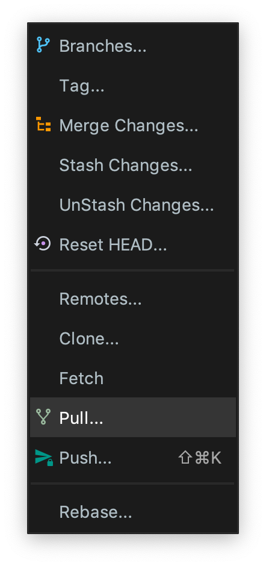

# Github Pull 가이드 입니다.

> 항상 프로그램을 작성하시기 전에 꼭 한번씩 해주시면 됩니다.

## 1. Open git pull menu

    

    

    

## 2. Check Branches to merge

## 3. Check complete to pull in local project

* 빨간 박스 안과 비슷하게 뜨면 pull 성공 

