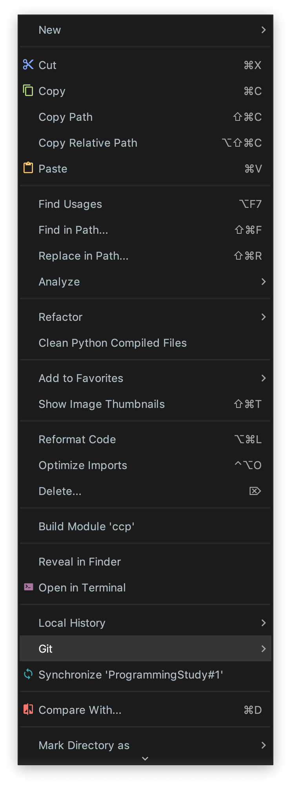

# Github Push 가이드 입니다.

## 1. Write code (Study, Problem, Project, etc...) in Private Your Project

## 2. Create directory and files and Copy code in Ccp.Playground Project (Local Repo)

* 이미 폴더가 있다면, 생성하지 않아도 됩니다.
* 문제 하나당, 파일 하나씩 생성하셔야 코드 리뷰시 편리합니다.
* Ccp 프로젝트에서 코딩을 하는것이 아니라, 자신의 프로젝트에서 구현후, 복사 붙혀넣어 주시면 됩니다.

## 3. Commit Directory

    

    

* 자신의 이름으로 된 폴더의 우클릭을 한 후 git을 선택하시면 됩니다.

## 4. push Directory

    

    

    

## 5. Pull Request

